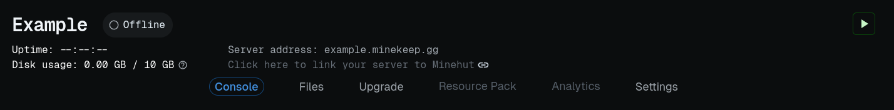
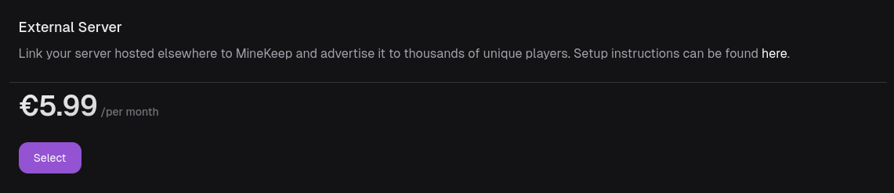
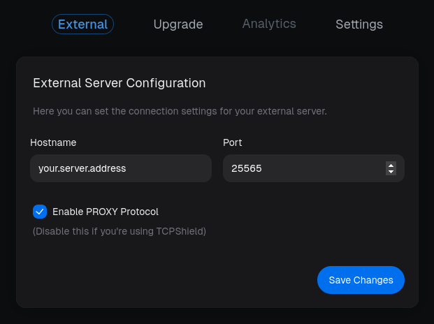

# External Servers


The MineKeep session server is also compatible with Minehut. Thus, you can configure your backend to use the MineKeep session server, and point both your MineKeep and Minehut externals to it. This removes the need for having several proxies.\
\
Note, this does not work the other way around!


## Step 1. Prepare your target server

In order to allow players to connect to your server through MineKeep, you'll have to configure your server to use MineKeep's session server, and optionally enable the PROXY protocol (recommended).


Not enabling the PROXY protocol makes everyone appear to connect from the same IPs. If you IP ban users without enabling the PROXY protocol, you'll effectively be banning everyone from your external server.


The exact configuration changes needed differ depending on what server software you run. Here are some examples for popular server softwares.

### Velocity

If you wish to enable the PROXY protocol, set `haproxy-protocol = true` in **velocity.toml**.

Then, proceed to add the following command line option to your startup script:


You must add the flags between `java` and `-jar`, otherwise they will not take effect


```bash
-Dmojang.sessionserver=https://sessionserver.minekeep.net/session/minecraft/hasJoined
```

If added correctly, your startup script should look something like this:

```bash
java -Dmojang.sessionserver=https://sessionserver.minekeep.net/session/minecraft/hasJoined -jar velocity.jar
```

### Waterfall

If you wish to enable the PROXY protocol, go to **config.yml** and set:

```yaml
listeners:
- ...
  proxy_protocol: true
```

Then, proceed to add the following command line option to your startup script:


You must add the flags between `java` and `-jar`, otherwise they will not take effect


```bash
-Dwaterfall.auth.url="<https://sessionserver.minekeep.net/session/minecraft/hasJoined?username=%s&serverId=%s%s>"
```

If added correctly, your startup script should look something like this:

```bash
java -Dwaterfall.auth.url="<https://sessionserver.minekeep.net/session/minecraft/hasJoined?username=%s&serverId=%s%s>" -jar waterfall.jar
```

### Bungeecord

Bungeecord is obsolete, and furthermore is not supported due to there [not being a configurable session server property](https://github.com/SpigotMC/BungeeCord/pull/3201). You can switch to [Waterfall](https://papermc.io/downloads/waterfall) if you still need the plugin ecosystem provided by Bungeecord. Otherwise, switching to [Velocity](https://papermc.io/software/velocity) is the recommended option.

### Paper Standalone


This only applies if you're Paper without a proxy in front of it. If you have a proxy, and you've already configured your proxy, you can ignore this.


If you wish to enable the PROXY protocol, go to **config/paper-global.yml** and set

```yaml
proxies:
  proxy-protocol: true
```

Then, make sure to set `enforce-secure-profile=false` in **server.properties.**

Finally, add the following command line options to your startup script:


You must add the flags between `java` and `-jar`, otherwise they will not take effect


```bash
-Dminecraft.api.auth.host=https://authserver.mojang.com/ -Dminecraft.api.account.host=https://api.mojang.com/ -Dminecraft.api.services.host=https://api.minecraftservices.com/ -Dminecraft.api.profiles.host=https://api.mojang.com/ -Dminecraft.api.session.host=https://sessionserver.minekeep.net
```

If added correctly, your startup script should look something like this:

```bash
java -Dminecraft.api.auth.host=https://authserver.mojang.com/ -Dminecraft.api.account.host=https://api.mojang.com/ -Dminecraft.api.services.host=https://api.minecraftservices.com/ -Dminecraft.api.profiles.host=https://api.mojang.com/ -Dminecraft.api.session.host=https://sessionserver.minekeep.net -jar paper.jar
```

## Step 2. Create an external server

Start by creating a server. Open its panel, and click the _**Upgrade**_ button.

<figure><figcaption><p>A screenshot of the top of the server panel</p></figcaption></figure>

Proceed to click _**Select**_ on the external server plan.

<figure><figcaption><p>The external upgrade button</p></figcaption></figure>

After completing checkout, your server console will have been replaced by a configuration panel. Here, you enter the server address and port of your target server. Make sure to enable PROXY protocol if your server is configured to accept that.

<figure><figcaption><p>The external server configuration panel</p></figcaption></figure>

### Step 3. Verify server connection

Everything is now set up. Now, verify that your external server is set up correctly by connecting to your server. This can be done either by joining `<server name>.minekeep.gg` or by running the command `/join <server name>`. If you need additional help, feel free to open a ticket on [our Discord](https://discord.minekeep.net).

### Rules and guidelines

These may change at any time. It is your responsibility to ensure continuous compliance.

* All standard MineKeep rules apply
* You cannot connect more than one MineKeep server to the same backend
* Your cannot direct players to leave MineKeep, or directly join your server address
