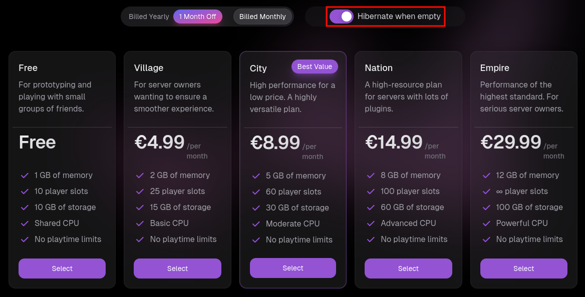

# Hibernation

In order to not run out of compute resources, MineKeep hibernates (shuts down) user servers after they've been left for five minutes without any players on. The five minute timer starts immediately when a server is empty, and cancels immediately once someone logs back on.

Contrary to what other hosts do, your server will be automatically started if a player tries to join it. For example, if the server "example" is offline and someone attempts to join `example.minekeep.gg`, they will be sent to the lobby as the server begins starting up. Once the server finishes starting up, the player is redirected to the server without requiring any user interaction.

### Whitelisted servers

If a server has whitelist enabled, only players which either are on the whitelist or have operator permissions can trigger the server to start up.

### Disabling Hibernation

If you want your server to always be online, you can purchase a plan without hibernation. To do this go to the upgrade tab in your servers panel and disable the hibernation toggle.

<figure><figcaption></figcaption></figure>

All plans purchased with this toggle *disabled* will not go offline automatically. However this is usually not necesary for most servers.
