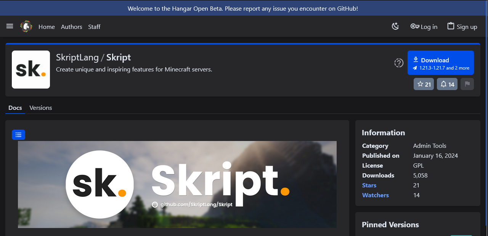
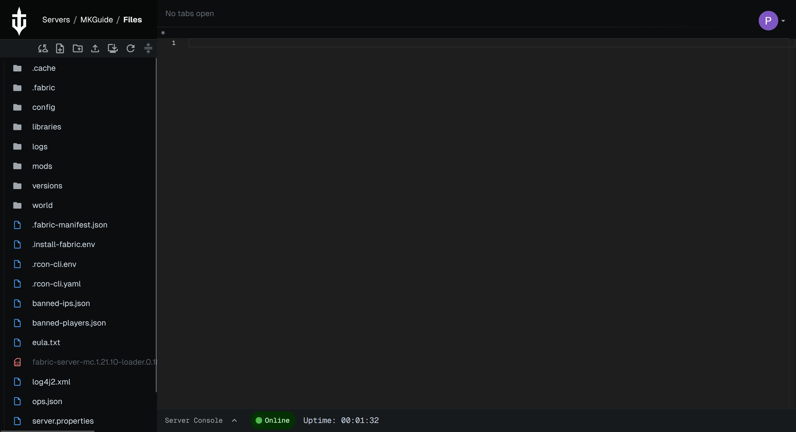

# Adding mods


MineKeep servers **only** support **Fabric** mods. Please ensure you do not attempt to install Forge or NeoForge mods, as they will not work.


Fabric mods are a way to change the gameplay or add new content to your server. Unlike plugins, mods generally require players to have the same mods installed on their client to connect.

**Important:** Most Fabric mods require the **Fabric API** mod to be installed as well. You should treat Fabric API as an essential installation before adding other mods.

### Finding Fabric Mods

Before you install a mod, you first need to find and download the mod file. We recommend the use of either [CurseForge](https://www.curseforge.com/minecraft/search?class=mc-mods) or [Modrinth](https://modrinth.com/mods) for downloading mods. Below are guides on how to download the correct Fabric version from each platform:



To download a mod from [CurseForge](https://www.curseforge.com/minecraft/search?class=mc-mods), you first need to find a mod you want to install.

**Searching for a specific mod**

You can search for a specific mod by using the search bar at the top of the CurseForge website.

<figure><figcaption></figcaption></figure>

Type the name of the mod you want, and press enter. Select the correct mod from the list of results.

**Downloading the Fabric version**

Once you are on the mod's page, do **not** click the main download button immediately. Instead, click on the **Files** tab. This is crucial to ensure you get the Fabric version and not the Forge version.

<figure><figcaption></figcaption></figure>

From the Files list, you must filter by your **Game Version** (e.g., 1.20.1) and ensure the **Mod Loader** is set to **Fabric**.

<figure><figcaption></figcaption></figure>

Once you find the file that matches your version and says "Fabric", click the three dots icon, and select the "Download file" button from the list of options.

<figure><figcaption></figcaption></figure>

You should now have a .jar file downloaded to your device. You can now continue on to the rest of the tutorial below.



To download a mod from [Modrinth](https://modrinth.com/mods), you first need to find a mod you want to install.

**Searching for a specific mod**

You can search for a desired mod on Modrinth via the search bar found on the mods page.

<figure><figcaption></figcaption></figure>

From here, you can enter the name of the mod you wish to download. To make things easier, you can select "Fabric" under the "Loader" filter on the left side of the page.

**Downloading the Fabric version**

Now that you have selected the mod you want to download, you should be on the mod's resource page. Click the "Versions" tab or the green "Download" button.

<figure><figcaption></figcaption></figure>

**Crucial Step:** When looking at the list of versions, you must ensure the file is tagged with **Fabric**. Do not download files tagged only with "Forge" or "NeoForge".

<figure><figcaption></figcaption></figure>

After verifying the version is for Fabric, click the download button (usually a small download icon) to save the .jar file onto your device.

You can now continue on to the rest of the tutorial below.



Now that you have the Fabric mod you want to add to your server, go to the [MineKeep Dashboard](https://minekeep.net/servers) and select the cog icon next to the name of your server. This will bring you to the management page for your server. It should look something like this:

<figure><figcaption></figcaption></figure>

From here, you can click on the button that says "Files". This will bring you to the file manager for your server. It should look something like this:

<figure><figcaption></figcaption></figure>

If you do not see the **"mods"** folder, you can create one by clicking the Create a folder button highlighted below (ensure you name it `mods` in all lowercase):

<figure><figcaption></figcaption></figure>

Now that you have a "mods" folder, select the folder by clicking it, and then click the upload button (the button to the right of the Create a folder button). This will bring up an upload dialog that allows you to either select a file, or drag a file on to it. From here, you can select the main area of the dialog, which will open a file selection window. Use this to navigate to the .jar file you previously downloaded, then select it. This will upload the mod to your MineKeep server.

#### Important Notes on Fabric Mods

1. **Fabric API:** Almost all Fabric mods require a separate mod called [**Fabric API**](https://modrinth.com/mod/fabric-api) to work. Please download it and upload it to your `mods` folder alongside your other mods.
2. **Dependencies:** Check the mod's download page for other requirements. Some mods require libraries like "Cloth Config" or "Architectury".
3. **Restart:** You must restart your server for mods to load.
4. **Client Installation:** Remember, if the mod adds new blocks or items, you must install the exact same mod version on your own Minecraft client to join the server.
