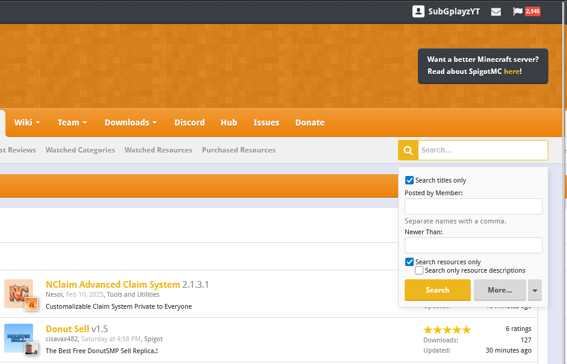
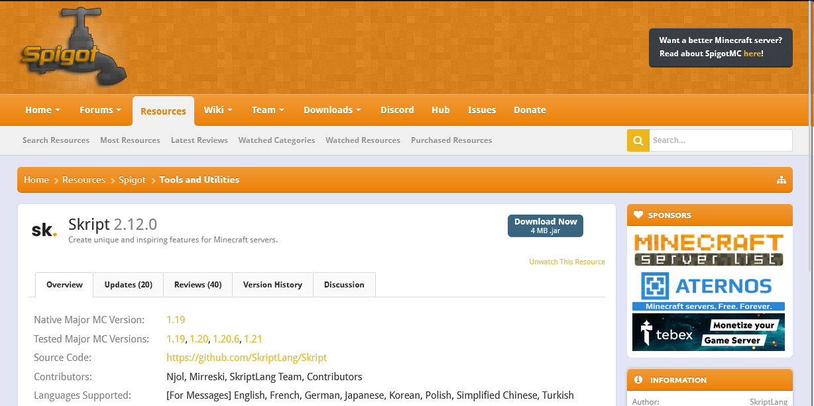
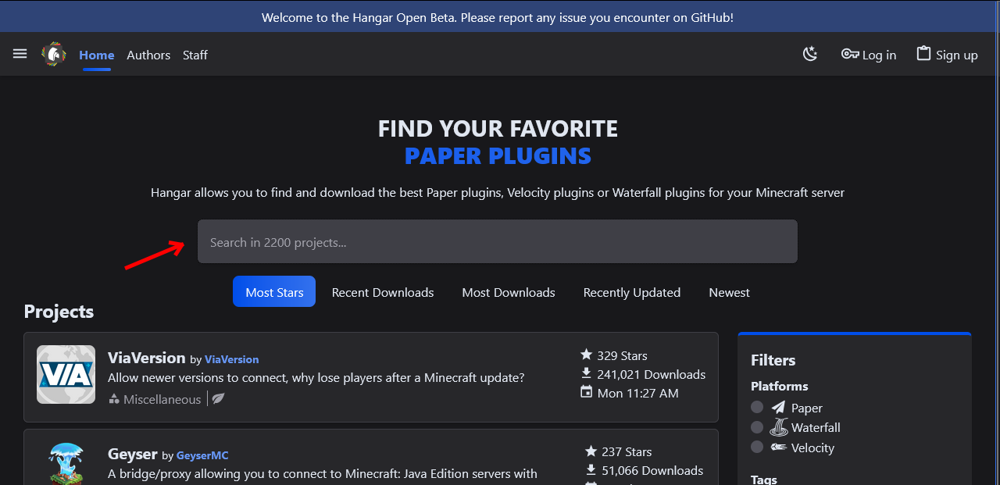
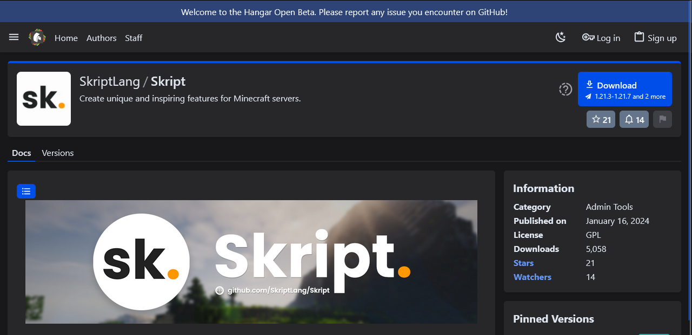
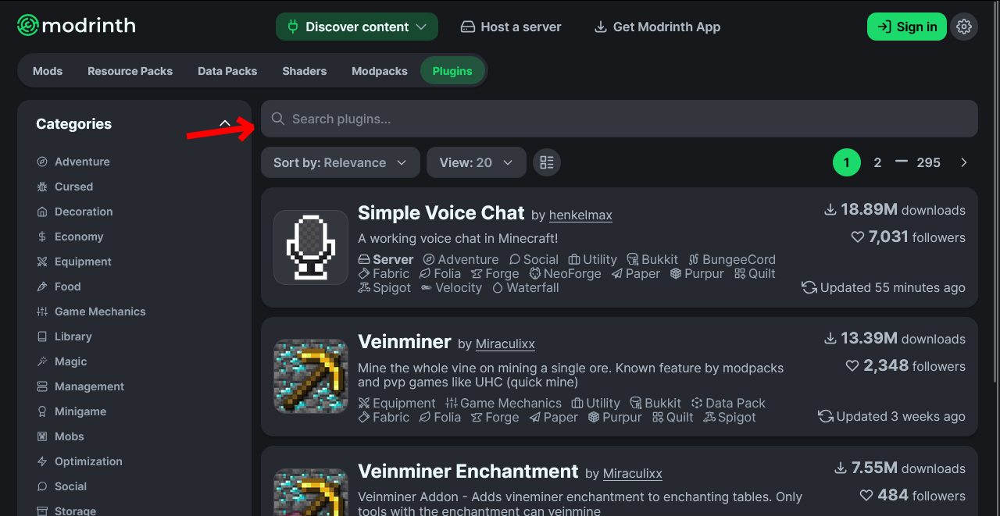
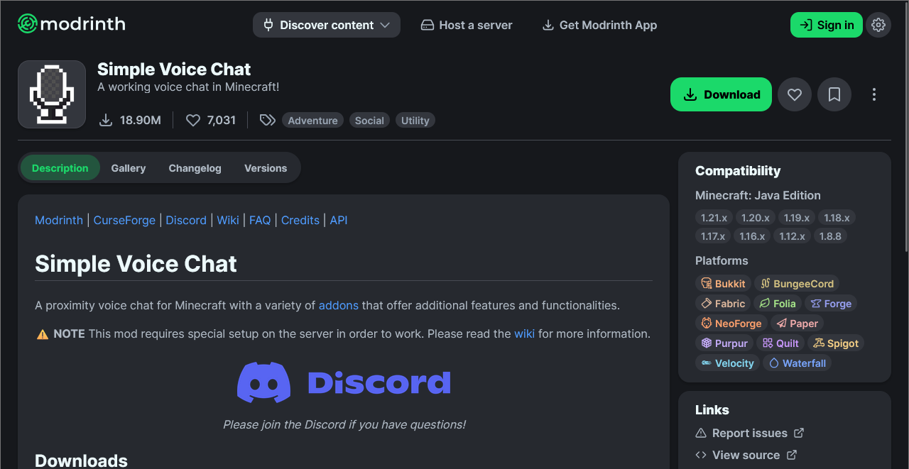
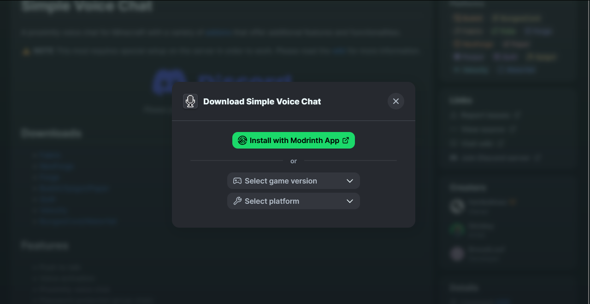
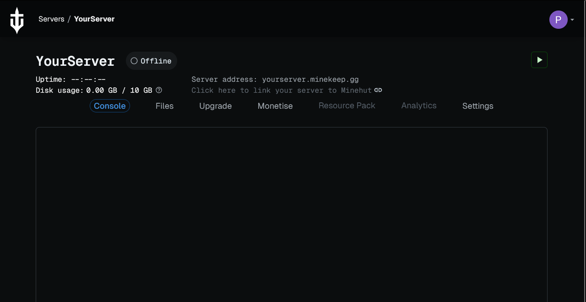
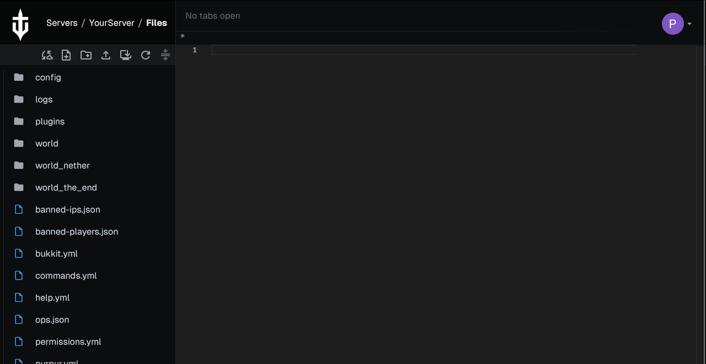
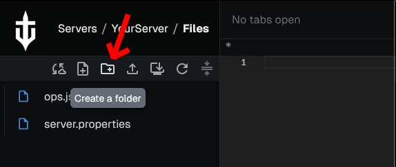

# Adding plugins

Plugins are a way to extend the functionality of your Paper/Purpur server whilst still allowing any player to connect, regardless of what mods they may have installed.

## Finding plugins

Before you install a plugin, you first need to find and download the plugin you want to install. We recommend the use of either [SpigotMC](https://www.spigotmc.org/resources/), [Hangar](https://hangar.papermc.io/) or [Modrinth](https://modrinth.com/plugins) for downloading plugins. Below are guides on how to download a plugin from each platform:



To download a plugin from [SpigotMC](https://www.spigotmc.org/resources/), you first need to find a plugin you want to install. This can be done in two ways - You can select a plugin from the [resources page](https://www.spigotmc.org/resources/), or you can search for a plugin by name.

#### Choosing a plugin from the resources page

Selecting a plugin from the resources page is as easy as going onto the resources page and then clicking on the name of the desired plugin.

#### Searching for a specific plugin

Searching for a specific plugin is slightly more difficult. To do this, first go onto the [resources page](https://www.spigotmc.org/resources/), and then select the search bar in the top right of the screen. It should look something like this:

<figure><figcaption></figcaption></figure>

Once you have this, you can type the name of the plugin you want into the search bar, and after making sure "Search titles only" and "Search resources only" are selected, press the search button. This will then show you a list of all resources with a same or similar name, in which you can select the one that you are looking for.

#### Downloading the selected plugin

Now that you have selected the plugin you want to download, you should be on the plugin's resource page, which will look something like this:

<figure><figcaption></figcaption></figure>

From this page, you can click the blue button that says "Download Now". In some cases, this button may take you to an external site, in which there may be an additional step required to download the plugin.

Some plugins may be a premium resource, which is where you have to pay to download and use the plugin. If this is the case, you may have to create a SpigotMC account and follow the steps to purchase the plugin before downloading it.

You should now have a .jar file downloaded to your device, which is the plugin file. You can now continue on to the rest of the tutorial below.



To download a plugin from [Hangar](https://hangar.papermc.io/), you first need to find a plugin you want to install. This can be done in two ways - You can select a plugin from the [home page](https://hangar.papermc.io/), or you can search for a plugin.

#### Choosing a plugin from the home page

Selecting a plugin from the home page is as easy as going to the [Hangar Website](https://hangar.papermc.io/) and then clicking on the desired plugin.

#### Searching for a specific plugin

You can search for a desired plugin on Hangar via the search bar found on the home page. This search bar is pointed out below:

<figure><figcaption></figcaption></figure>

From here, you can enter the name of the plugin you wish to download, and hangar will then display plugins with the same or similar name, which you can then select the correct item.

#### Downloading the selected plugin

Now that you have selected the plugin you want to download, you should be on the plugin's resource page, which will look something like this:

<figure><figcaption></figcaption></figure>

From this page, you can click the blue button that says "Download". In some cases, this button may take you to an external site, in which there may be an additional step required to download the plugin.

You should now have a .jar file downloaded to your device, which is the plugin file. You can now continue on to the rest of the tutorial below.



To download a plugin from [Modrinth](https://modrinth.com/plugins), you first need to find a plugin you want to install. This can be done in two ways - You can select a plugin from the [plugins page](https://modrinth.com/plugins), or you can search for a plugin.

#### Choosing a plugin from the plugins page

Selecting a plugin from the home page is as easy as going to the [Modrinth plugins page](https://modrinth.com/plugins) and then clicking on the desired plugin.

#### Searching for a specific plugin

You can search for a desired plugin on Modrinth via the search bar found on the plugins page. This search bar is pointed out below:

<figure><figcaption></figcaption></figure>

From here, you can enter the name of the plugin you wish to download, and Modrinth will then display plugins with the same or similar name, which you can then select the correct item.

#### Downloading the selected plugin

Now that you have selected the plugin you want to download, you should be on the plugin's resource page, which will look something like this:

<figure><figcaption></figcaption></figure>

From this page, you can click the green button that says "Download". Clicking this will display a popup like this one:

<figure><figcaption></figcaption></figure>

From here, you can open the select game version option and choose the version of your server, and when it asks you to select a platform, choose paper. If paper is not an option, you may be given the option to use spigot or bukkit, which may also work.

After selecting these options, you will be shown another green button with the text "Download" written on it. Press this to download the plugin's .jar file onto your device.

You should now have a .jar file downloaded to your device, which is the plugin file. You can now continue on to the rest of the tutorial below.



Now that you have the plugin you want to add to your server, go to the [MineKeep Dashboard](https://minekeep.net/servers) and select the cog icon next to the name of your server. This will bring you to the management page for your server. It should look something like this:

<figure><figcaption></figcaption></figure>

From here, you can click on the button that says "Files". This will bring you to the file manager for your server. It should look something like this:

<figure><figcaption></figcaption></figure>

If you do not see the "plugins" folder, you can create one by clicking the Create a folder button highlighted below:

<figure><figcaption></figcaption></figure>

Now that you have a "plugins" folder, select the folder by clicking it, and then click the upload button (the button to the right of the Create a folder button). This will bring up an upload dialog that allows you to either select a file, or drag a file on to it. From here, you can select the main area of the dialog, which will open a file selection window. Use this to navigate to the .jar file you previously downloaded, then select it. This will upload the plugin to your MineKeep server.

Now, when you start your server, the plugin should be shown when you do `/plugins` in-game or in the console. If this is green, congratulations, you have successfully installed a plugin on your MineKeep server! If the plugin is red, this most likely means that either the plugin requires another plugin to work, or that it requires configuration. To check, go back to the plugin page of the plugin you downloaded and check for any mentions of "requirements" in the plugin's description. You can also look for a support link, and if they have one you can ask the plugin's developer or community for support.
